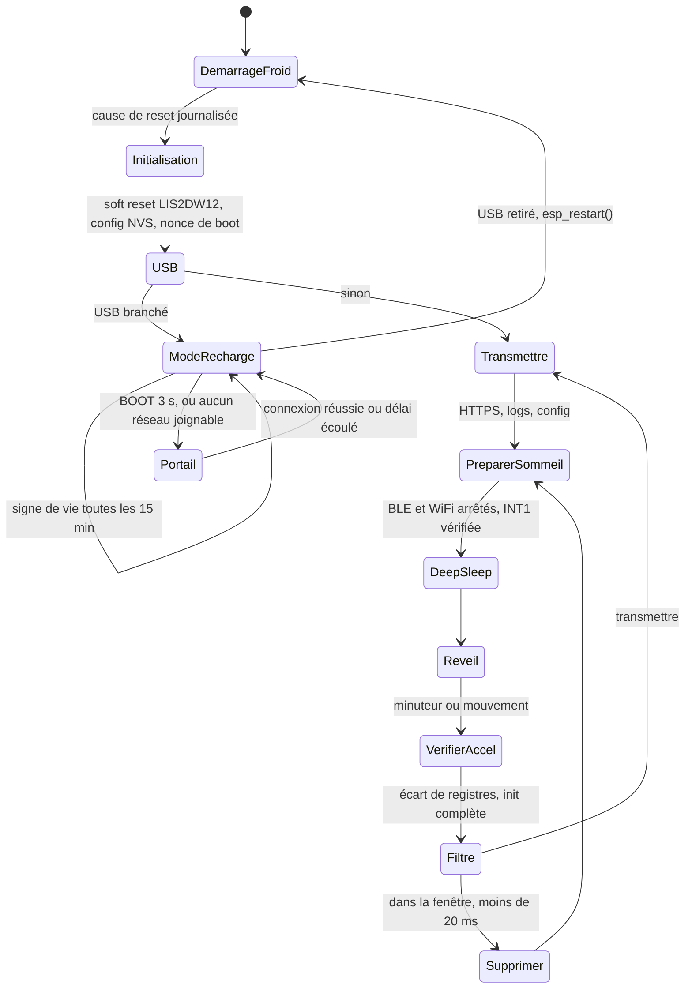

# Spécification — Capteur de veille (refonte)

Version du 2026-10-07. Vocabulaire : `CONTEXT.md`. Décisions structurantes : `docs/adr/`.

## Objet et principes

Ce firmware fait d'un XIAO ESP32-C6 un capteur d'activité sur batterie : il dort, se réveille sur mouvement ou sur minuteur, et transmet par HTTPS au serveur existant. Six principes, chacun né d'un incident du premier projet, priment sur toute fonctionnalité.

| Principe | Ce qu'il impose | Incident d'origine |
| --- | --- | --- |
| L'observabilité précède les fonctionnalités | Logs BLE, LED et diagnostics persistants avant tout ajout | Six nuits de silence sans aucune donnée exploitable |
| Construire par paliers validés | Un palier = une pièce + un critère écrit à l'avance | Bisect contaminé, régressions introuvables |
| Un seul chemin d'endormissement | Le debug observe, il ne modifie jamais le cycle | Modes « rester éveillé » qui ont faussé des heures de tests |
| Initialisations déterministes | État de départ connu, aucune config par ajouts | LIS2DW12 conservant `int1_6d` d'une session antérieure |
| Mesuré ou supposé, toujours dit | Chaque conclusion cite sa mesure et son env de build | Conclusions « par lecture de code » contredites ensuite |
| Dans le doute, transmettre | L'incertitude produit un message, jamais un silence | Filtre supprimant tout avec une horloge figée |

## Périmètre

La v1 couvre le cycle complet sommeil, réveil et transmission, avec les deux modes de détection et les logs BLE ; l'angle, la durée d'ouverture et l'OTA attendent la v2.

| Fonction | Version | Note |
| --- | --- | --- |
| Deep sleep, réveil minuteur et mouvement | v1 | Cœur du produit |
| Modes Motion et Rotation, configurables | v1 | Motion par défaut, seul mode déjà validé |
| Transmission HTTPS vers le serveur existant | v1 | Protocole étendu, voir Réseau |
| Logs BLE lus par l'agent | v1 | Env `test` seulement |
| Mode recharge et portail de configuration | v1 | Voir la section dédiée |
| Angle et durée d'ouverture | v2 | Exige le mode Rotation validé |
| Mise à jour OTA | v2 | Point d'accroche `fw_available` prévu dès la v1 |
| Reprise de session TLS | v2 | Principal levier d'autonomie restant |

Hors périmètre : MQTT, light sleep, tout autre capteur.

## Matériel

Le matériel reste celui du premier projet, plus trois composants obligatoires qui n'avaient jamais été posés : le condensateur réservoir, le rappel sur INT1 et les points de mesure.

| Composant | Rôle | Obligatoire |
| --- | --- | --- |
| Seeed XIAO ESP32-C6 | MCU, chargeur SGM40567, abaisseur SGM6029C | Oui |
| LIS2DW12 sur carte de dérivation, broche INT1 sortie | Détection | Oui |
| LiPo 103450, 3,7 V, 2000 mAh, avec protection | Alimentation, soudée sur les pastilles BAT | Oui |
| Condensateur 470 µF faible ESR, entre 3V3 et GND | Absorbe les pointes de 350 mA en émission | Oui |
| Résistance 220 kΩ entre GPIO2 et GND | Niveau défini sur INT1 si le LIS2DW12 ne la pilote plus | Oui |
| Pont diviseur 2 × 200 kΩ vers A1 | Tension batterie | Oui |
| Pont diviseur VBUS vers A0 | Détection USB pour le mode recharge | Oui |
| Shunt 1 Ω sur le fil négatif de la batterie | Mesure de courant au multimètre | Banc d'essai seulement |

| GPIO | Broche | Usage |
| --- | --- | --- |
| GPIO0 | A0 / D0 | Détection VBUS |
| GPIO1 | A1 / D1 | Tension batterie |
| GPIO2 | D2 | INT1 du LIS2DW12, réveil EXT1 |
| GPIO22 | D4 | SDA |
| GPIO23 | D5 | SCL |
| GPIO15 | LED intégrée | Codes d'état, actif bas, env `test` seulement |

GPIO0 à GPIO2 sont les seules broches de réveil sorties sur cette carte, et elles sont toutes utilisées. Le rappel de 220 kΩ ne consomme rien quand INT1 est basse, et environ 15 µA pendant les brèves impulsions hautes.

Rappels électriques : seuil de batterie faible à 3500 mV, parce que sous 3,6 V le SGM6029C passe de 15 à environ 300 µA de sommeil. Jamais de piles primaires ni de LiFePO4 sur les pastilles BAT.

## Architecture du firmware

Le firmware est une machine à états explicite à deux entrées, démarrage à froid et réveil, qui convergent toutes vers une unique préparation du sommeil.

Le mode recharge est le seul état qui ne mène pas au sommeil : il en sort par un redémarrage volontaire. Le code s'organise en modules HAL (alimentation, accéléromètre, WiFi, NVS, BLE, LED) autour d'une logique pure, sans dépendance matérielle, couverte par les tests natifs.

## Détection

Deux modes configurables par appareil, Motion par défaut ; chaque initialisation part d'un soft reset du LIS2DW12, parce que la puce reste alimentée et conserve ses registres à travers les resets et les flashes de l'ESP32.

| Mode | Usage | Fonction du LIS2DW12 | CTRL4 écrit en entier |
| --- | --- | --- | --- |
| Motion | Tiroirs, objets sans charnière | Wake-up : seuil en mg + durée minimale | `0x20` (`int1_wu`, bit 5) |
| Rotation | Portes à charnière | Orientation 6D | `0x80` (`int1_6d`, bit 7) |

Séquence `init()`, identique pour les deux modes :

1. Soft reset (bit `SOFT_RESET` de CTRL2), puis scruter le bit jusqu'à ce qu'il retombe, jamais un délai fixe.
2. Mode basse consommation 1, 12,5 Hz, pleine échelle ±2 g, BDU actif : CTRL1 doit relire `0x20`.
3. Verrou d'interruption LIR (CTRL3 bit 4).
4. Configuration propre au mode (seuil, durée, ou 6D).
5. CTRL4 écrit avec sa valeur complète, jamais en lecture-modification-écriture.
6. Activation globale des interruptions (CTRL7 bit 5).
7. Lecture de `ALL_INT_SRC` pour effacer tout événement résiduel.
8. Relecture de CTRL1 à CTRL7 et comparaison aux valeurs attendues ; un écart est journalisé et l'init rejouée une fois.

Au réveil normal, pas de soft reset : les registres survivent au deep sleep, c'est mesuré. Une relecture de CTRL1, CTRL4 et CTRL7 suffit, et seul un écart déclenche `init()`. Un changement de mode venu du serveur déclenche aussi `init()`.

En mode Rotation, la référence « fermé » est calibrée au démarrage à froid, après le premier échantillon disponible, et le résultat est journalisé. En v1, tout changement d'orientation est un mouvement, ouverture comme fermeture ; la distinction et la durée d'ouverture restent en v2, avec en vue une alerte « porte de frigo restée ouverte ».

À vérifier dans `lis2dw12_reg.h` avant codage : l'adresse de `ALL_INT_SRC` (`0x3B` attendu) et les valeurs de référence de CTRL3 et CTRL6, à consigner après la première mesure au palier 2.

## Sommeil et réveil

Une seule fonction `go_to_sleep()` mène au deep sleep, sans variante de debug, et elle refuse d'armer le réveil par mouvement tant qu'INT1 n'est pas réellement basse.

Séquence, dans cet ordre :

1. Arrêter proprement le BLE puis le WiFi.
2. Acquitter l'accéléromètre via `ALL_INT_SRC`.
3. Lire GPIO2 avec `rtc_gpio_get_level()`, jamais `digitalRead()` : après un réveil EXT1 la broche peut rester rattachée au domaine basse consommation.
4. INT1 haute : réacquitter jusqu'à trois fois, 10 ms d'intervalle.
5. Toujours haute : ne pas armer l'EXT1, armer un minuteur de 5 s seul, journaliser l'incident.
6. Sinon : EXT1 sur GPIO2 en `ANY_HIGH`, plus le minuteur.
7. Borner le minuteur entre 30 s et 4 h ; journaliser la valeur avant et après bornage si elles diffèrent.
8. Aucune source armée avec succès : écrire la raison dans le journal persistant, puis `esp_restart()`. Au-delà de trois redémarrages consécutifs pour cette raison, minuteur d'une heure seul.
9. Éteindre la LED et libérer ses broches, puis `esp_deep_sleep_start()`.

`ESP_OK` à l'armement prouve seulement que le paramètre est accepté ; c'est pourquoi l'état d'INT1 est vérifié avant de dormir. Le maintien d'une broche numérique comme GPIO15 en deep sleep passe par une API propre au C6, à vérifier dans la doc ESP-IDF.

Au réveil, la première action est de lire la cause du réveil et la cause de reset du démarrage courant, puis de les journaliser. Le chemin « mouvement supprimé » reste sous 20 ms : aucun WiFi, aucun BLE, aucune écriture NVS.

## Horloge, filtre et heartbeats

L'heure se reconstruit à partir d'une ancre fournie par le serveur et d'un compteur qui avance pendant le deep sleep ; tant qu'elle est inconnue ou incohérente, le capteur transmet au lieu de filtrer.

**Horloge.** `now = server_time + (compteur_RTC_maintenant − compteur_RTC_à_la_synchro)`. Le compteur retenu doit avancer pendant le deep sleep : `esp_rtc_get_time_us()` fonctionne mais c'est une API interne, à documenter avec la version d'IDF validée. Après chaque synchro et chaque réveil, `settimeofday()` recopie cette valeur dans l'horloge système, que mbedtls utilise pour valider les dates des certificats. Fuseau `EST5EDT,M3.2.0,M11.1.0` réglé au démarrage. Avant la première synchro, `now` vaut 0.

**Filtre.** Un mouvement survenant moins de `filter_window_s` après la dernière transmission est supprimé et compté. `now = 0` ou delta négatif : transmettre et journaliser. `last_tx` s'écrit après le ré-ancrage de l'horloge, jamais avant. Après 5 suppressions consécutives, une transmission est forcée. Un mouvement supprimé reste une activité (ADR 0002) : le capteur mémorise l'instant de la première et de la dernière suppression et les transmet sous forme d'âges relatifs avec le compteur.

| Paramètre | Production | Test rapide | Bornes |
| --- | --- | --- | --- |
| Heartbeat de jour, 7 h à 23 h | 3600 s | 120 s | 300 à 21600 s |
| Heartbeat de nuit | 14400 s | 120 s | 900 à 14400 s |
| Fenêtre de filtrage | 900 s | 30 s | 0 à 3600 s |
| Repli après échec | 30 s doublé, plafond 3600 s | identique | — |

Avant la première synchro, l'heure est inconnue et le heartbeat de jour s'applique. La config de test ne change que ces constantes, jamais le chemin d'exécution.

## Réseau et protocole serveur

Une seule requête HTTPS sortante par cycle, identifiée par un nonce de boot aléatoire pour que le dédoublonnage ne dépende plus de compteurs qui peuvent se répéter.

**WiFi.** Trois emplacements d'identifiants en NVS, essayés dans l'ordre du dernier succès ; l'emplacement 2 est réservé au partage de connexion de l'installateur. Chemin rapide : canal, BSSID et IP statique mémorisés en RTC. Échec du chemin rapide : scan complet puis DHCP, puis nouvelle mémorisation. Délai maximal 8 s.

**TLS.** Racine CA épinglée (ISRG Root X1), jamais le certificat feuille. Jeton de 32 octets propre à l'appareil, stocké en NVS, jamais dans le dépôt.

**Requête** `POST /api/v1/events` :

| Champ | Contenu |
| --- | --- |
| `device_id`, `fw_version` | Identité |
| `boot_nonce` | `esp_random()` tiré à chaque démarrage à froid, gardé en RTC |
| `boot_count`, `seq` | Compteurs, informatifs seulement |
| `kind` | `boot`, `heartbeat`, `motion`, `battery_low` ; seul `motion` est une activité, les autres sont des signes de vie |
| `wake_cause`, `reset_reason` | Du cycle courant |
| `battery_mv`, `rssi`, `suppressed` | Mesures |
| `suppressed_first_age_s`, `suppressed_last_age_s` | Âge de la première et de la dernière suppression |
| `charging` | Vrai en mode recharge |
| `queued` | Événements en attente, avec leur âge relatif |
| `open_angle`, `open_duration_s` | v2 |

Le serveur dédoublonne sur `(device_id, boot_nonce, seq)`, journalise chaque doublon et répond `"duplicate": true` dans ce cas. Ce point est à valider avec l'agent serveur au palier 4, voir la dernière section.

**Réponse.** `ok`, `server_time`, `config_version`, `config` complet à chaque réponse, `fw_available` réservé à la v2. La config porte un champ `verbose_until` : tant qu'il est dans le futur, le capteur journalise en mode verbeux ; passé ce moment, il revient seul au mode normal. Le serveur le règle à 24 h au plus.

**Configuration en trois couches** : valeurs compilées, puis NVS, puis serveur. Le capteur applique la config du serveur dès que `config_version` diffère de la sienne, dans un sens comme dans l'autre, et n'écrit en NVS que dans ce cas. Toute valeur est bornée par le firmware ; un écart corrigé est signalé au serveur. Ce point corrige le bug du mode de détection resté bloqué sur une ancienne valeur.

**File d'attente.** 16 événements en RTC, rejoués avec leur âge à la transmission suivante ; au-delà, les plus anciens sont écrasés et le nombre de pertes est transmis.

## Persistance

Chaque donnée est rangée selon ce à quoi elle doit survivre ; `RTC_DATA_ATTR` est réinitialisé à tout redémarrage autre qu'un réveil de deep sleep, y compris `esp_restart()`.

| Donnée | Emplacement | Deep sleep | `esp_restart()` | Bouton RESET | Coupure |
| --- | --- | --- | --- | --- | --- |
| `seq`, `last_tx`, ancre d'horloge, file, cache WiFi, `boot_nonce`, instants de suppression | `RTC_DATA_ATTR` | Oui | Non | Non | Non |
| Diagnostics du dernier cycle : causes, armement, niveau INT1 | `RTC_NOINIT_ATTR` | Oui | Oui | À vérifier | Non |
| Incidents graves : redémarrage du filet, INT1 bloquée | NVS | Oui | Oui | Oui | Oui |
| `boot_count`, config, identifiants WiFi, jeton | NVS | Oui | Oui | Oui | Oui |

Règles :

- La NVS ne s'écrit que sur changement : config de version nouvelle, incident grave, un seul `boot_count` par démarrage à froid. Jamais à chaque cycle.
- `nvs_get_stats()` est journalisé à chaque démarrage à froid, pour détecter la saturation qui a ralenti les démarrages du premier projet jusqu'à 91 s.
- `RtcState` porte un `magic` et un numéro de version de structure ; tout écart déclenche une initialisation à froid journalisée.
- `RtcState` est une structure POD, sans initialiseur de membre.

## Observabilité

Trois canaux indépendants du WiFi et du serveur permettent à l'agent de voir chaque cycle sans l'aide de l'utilisateur : les logs BLE, la LED et le journal persistant.

**Logs BLE, env `test` seulement.** Pendant chaque fenêtre d'éveil, le capteur annonce et pousse ses lignes par notifications : celles du cycle courant, plus les diagnostics du cycle précédent lus en `RTC_NOINIT_ATTR`. Un script récepteur sur le PC, en Python avec `bleak`, tourne en continu, se reconnecte seul et écrit un fichier horodaté que l'agent lit directement. Le récepteur note aussi chaque absence d'annonce et sa durée : un trou plus long que le heartbeat est déjà un symptôme.

Le BLE est arrêté avant chaque sommeil. Un test d'une journée a montré qu'il ne perturbe pas le minuteur, mais il ne doit pas être actif en deep sleep.

**LED, env `test` seulement**, éteinte avant chaque sommeil :

| Signal | Signification |
| --- | --- |
| 1 éclair | Réveil minuteur |
| 2 éclairs | Réveil mouvement |
| 3 éclairs | Démarrage à froid |
| 1 éclair long | Anomalie journalisée ce cycle |

**Diagnostics à chaque cycle, en champs structurés** dans la charge utile, jamais en texte libre : cause de réveil, cause de reset du démarrage courant, décision de filtrage avec son delta, durée de chaque phase (WiFi, TLS, POST), résultat de l'armement avec le niveau d'INT1 lu par `rtc_gpio_get_level()`. Le texte libre est réservé aux anomalies.

**Mode verbeux.** Activé à distance par `verbose_until` dans la config serveur, il ajoute des lignes de texte détaillées à chaque cycle et expire seul. Il allonge le cycle, c'est accepté puisqu'il est temporaire. En env `test`, les logs BLE sont toujours détaillés.

**Journal du projet.** Dans `CLAUDE.md`, chaque conclusion est marquée MESURÉ ou SUPPOSÉ, avec l'environnement de build et la date. Une hypothèse confirmée par lecture de code reste SUPPOSÉE.

## Mode recharge et portail de configuration

Brancher l'USB suspend la détection, pas les signes de vie (ADR 0001) : le capteur est alors retiré de son objet, et c'est le serveur qui gère l'absence.

**Mode recharge**
- **Entrée** : VBUS lu sur A0 au démarrage à froid et à chaque réveil.
- **Pendant** : le capteur reste éveillé, ne détecte aucun mouvement et envoie un signe de vie `heartbeat` avec `charging: true` et la tension toutes les 15 min. L'EXT1 n'est pas armé.
- **Sortie** : dès que VBUS disparaît, `esp_restart()` volontaire, puis cycle normal.
- **Durée** : 18 à 20 h pour une charge complète, le chargeur débitant 100 à 120 mA (ADR 0004).

**Portail de configuration**, uniquement en mode recharge :
- **Ouverture** par un appui de 3 s sur BOOT, confirmé par la LED, ou automatiquement tant qu'aucun réseau connu n'est joignable depuis 2 min.
- **Point d'accès** `Capteur-<nom>` en WPA2, mot de passe unique imprimé sur une étiquette. Le capteur continue d'essayer les réseaux connus en arrière-plan.
- **Fermeture** dès qu'une connexion réussit ; ouvert par BOOT, il se ferme aussi après 10 min sans activité.
- **Contenu** : DNS générique vers `192.168.4.1`, liste des réseaux détectés, mot de passe, choix de l'emplacement parmi les trois, bouton de test. Le test vérifie l'association WiFi puis un POST au serveur, et affiche les deux résultats séparément.
- **État usine** (ADR 0003) : tant que la NVS ne contient pas d'identité, le portail ajoute une page de mise en service : `device_id`, jeton, adresse du serveur. Elle ne réapparaît qu'après effacement complet de la flash. Le jeton et le serveur ne sont jamais modifiables autrement.

À vérifier au palier 7 : la lecture du bouton BOOT (GPIO9) en fonctionnement normal sur cette carte.

## Construction par paliers

Neuf paliers, chacun ajoutant une seule pièce, avec un critère de sortie fixé avant le premier essai ; un palier qui échoue arrête tout jusqu'à ce que cette pièce seule soit comprise.

0. **Banc d'essai.** Shunt soudé, LED, récepteur BLE sur le PC, protocole de flash écrit. Sortie : le récepteur capte un firmware vide qui annonce une ligne toutes les 10 s.
1. **Sommeil et minuteur.** Deep sleep, réveil à 30 s, LED et logs BLE. Sortie : 1 h sans un réveil manqué.
2. **Détection Motion et EXT1.** Séquence `init()` complète, garde INT1 avant sommeil. Sortie : protocole de test rapide réussi, registres de référence consignés.
3. **Détection Rotation.** Capteur fixé sur une vraie porte. Sortie : protocole réussi, puis bascule Motion ⇄ Rotation sans redémarrage manuel.
4. **WiFi et vrai serveur.** Protocole complet, `boot_nonce`, file d'attente. Sortie : protocole réussi, aucun doublon signalé par le serveur.
5. **Horloge, filtre, heartbeats jour et nuit.** Sortie : durées de sommeil rapportées à ±2 s, suppressions visibles, aucun delta négatif.
6. **NVS et configuration en trois couches.** Sortie : un changement de mode côté serveur appliqué au cycle suivant, `nvs_get_stats()` stable sur 100 démarrages.
7. **Mode recharge et portail.** Sortie : signes de vie de charge toutes les 15 min ; portail ouvert par BOOT et automatiquement sans réseau ; mise en service d'un capteur en état usine ; configuration du WiFi depuis un téléphone en moins de 3 min ; redémarrage propre au retrait de l'USB, 10 fois de suite.
8. **Endurance.** Valeurs de production, 72 h avec deux nuits. Sortie : tous les heartbeats à l'heure prévue, chaque mouvement détecté, `boot_count` inchangé.

Un commit par ticket, avec le résultat du test dans son message.

Découpage réel en tickets (`.scratch/capteur-veille/issues/`) : 01 ossature du dépôt ; palier 0 → 02 ; 1 → 03 ; 2 → 04 ; 3 → 05 (la bascule Motion ⇄ Rotation à chaud passe au 10) ; 4 → 06 (contrat serveur), 07 (WiFi), 08 (protocole) ; 5 → 09 ; 6 → 10 ; 7 → 11 (recharge), 12 (portail), 13 (mise en service) ; 8 → 14. Les identifiants WiFi restent dans un fichier local jusqu'au ticket 10.

## Protocole de test et de flash

Un test rapide de 40 minutes valide chaque palier ; une nuit complète ne sert qu'aux jalons.

**Flash, à chaque fois et sans exception :**

1. Effacer la flash (`pio run -t erase`).
2. Téléverser.
3. Débrancher l'USB.
4. Appuyer sur RESET.
5. Seulement ensuite, commencer à observer.

**Test rapide**, env `test`, heartbeat 120 s, fenêtre de filtrage 30 s. Bouger le capteur à T+0, T+2, T+5, T+10, T+20 et T+40 min, toujours au-delà de la fenêtre. Réussite : chaque mouvement produit un événement en quelques secondes, et un heartbeat arrive toutes les 2 min entre eux. Échec : la première absence suffit.

**Pendant une panne**, avant tout redémarrage : lire le shunt, 0 mV signifiant qu'il dort et 15 à 40 mV stables qu'il est bloqué éveillé ; puis bouger le capteur pour savoir si l'EXT1 est encore vivant. Ces deux observations sont notées avant d'appuyer sur RESET.

**Environnements de build**, trois au total :

| Env | Contenu |
| --- | --- |
| `native` | Tests unitaires de la logique pure : filtre, bornes, horloge, protocole |
| `test` | LED, logs BLE, constantes courtes ; CDC USB désactivé |
| `prod` | Ni LED ni BLE, constantes de production |

Aucune conclusion sur le sommeil ne se tire d'un build avec CDC USB actif, ni d'un capteur branché en USB.

## Interdits et pièges connus

Chaque ligne ci-dessous a coûté au moins une journée au premier projet.

| Interdit | Raison |
| --- | --- |
| Modes « rester éveillé » ou `ESP.restart()` comme fin de cycle | Faussent tout test de sommeil |
| Lecture-modification-écriture de CTRL4 | Hérite de bits posés par une session antérieure |
| `digitalRead()` sur GPIO2 avant le sommeil | Peut lire bas alors qu'INT1 est haute |
| Conclure depuis un build CDC actif ou un capteur branché | Cause de réveil et mémoire RTC faussées |
| Un log important uniquement en `RTC_DATA_ATTR` avant `esp_restart()` | Il est effacé au redémarrage |
| Lire l'heure depuis `time()` sans ré-ancrage | L'horloge système ne suit pas le deep sleep |
| Batterie sous 3,6 V, LiFePO4, piles primaires sur BAT | Régulateur à 300 µA ou chargeur sur une pile non rechargeable |
| Résistance de tirage de 10 kΩ sur une entrée au repos basse | 330 µA permanents |
| MPU-6050 | 500 µA au repos |
| MQTT, light sleep, `delay()` dans le cycle | Coût énergétique sans bénéfice |
| Certificat feuille épinglé | Un renouvellement casse tous les capteurs |
| Marquer un bug « résolu » sans citer la mesure | Trois fausses conclusions dans le premier projet |

## À trancher avec l'agent serveur au palier 4

Ces points touchent le serveur et seront discutés avec son agent avant de brancher le capteur au vrai serveur.

1. Accepter l'ancien et le nouveau format de requête pendant la transition : `boot_nonce` optionnel, repli sur `(boot_count, seq)` s'il manque.
2. Compter les mouvements supprimés comme activité, en plaçant leurs âges dans les fenêtres des règles d'inactivité.
3. Suspendre les règles d'inactivité d'un capteur en charge, et alerter si la charge dépasse 30 h.
4. Notifier « capteur chargé, il peut être remis en place » quand la tension reste au-dessus de 4150 mV sur trois mesures consécutives.
5. Pour une inactivité dans les 24 h suivant une recharge, un message distinct : « capteur récemment rechargé, vérifier qu'il a été remis en place ».
6. Exposer `verbose_until` dans la config, plafonné à 24 h.
